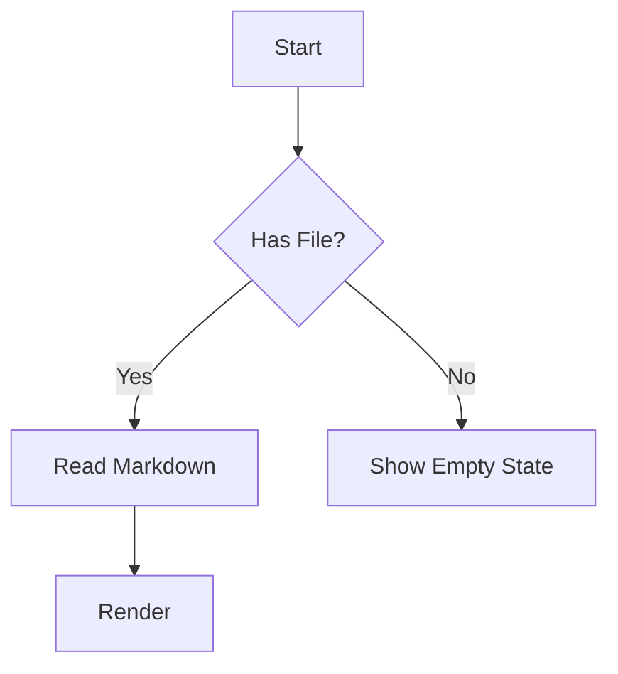
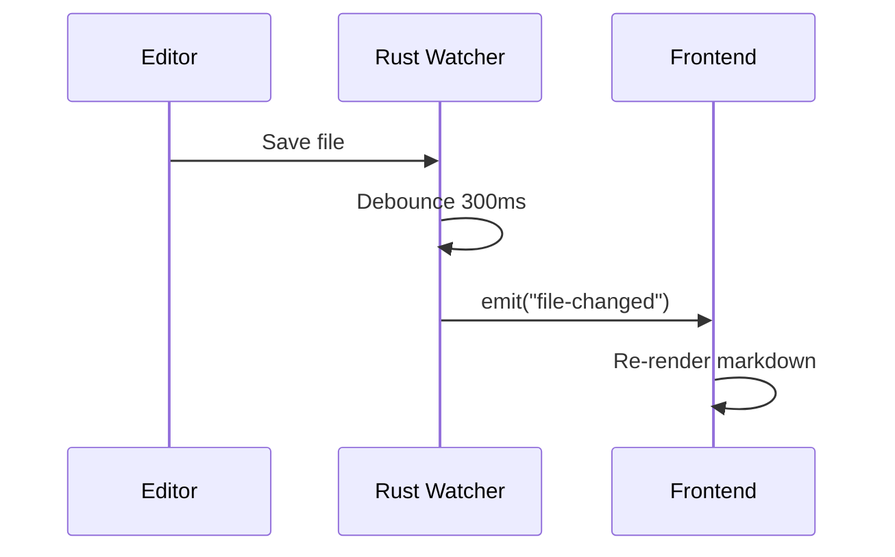
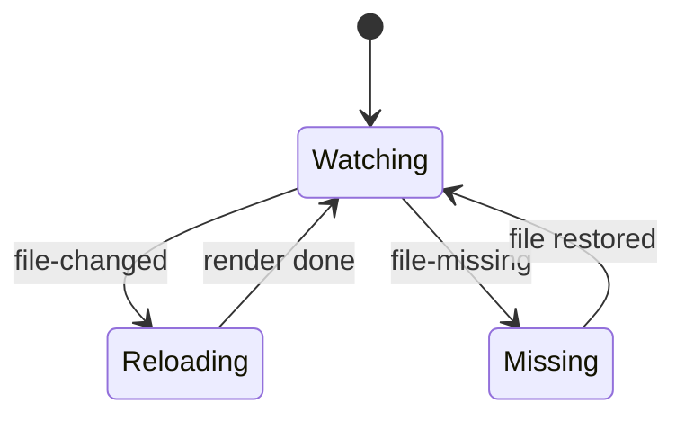

# MkViewer Test Sample

このファイルは MkViewer のレンダリング仕様を総合的に確認するためのテスト用サンプルです。

---

## 1. CommonMark Basic

### 見出しレベル

# H1
## H2
### H3
#### H4
##### H5
###### H6

### 段落・改行

これは通常の段落です。
同じ段落内で改行テストを行います。  
この行は行末スペース2つによる改行です。

空行を挟むと別段落になります。

### 強調

*italic* / _italic_  
**bold** / __bold__  
***bold italic***  
~~取り消し線（GFM）~~

### 引用

> これは引用です。
> 
> > これはネストした引用です。

### リスト

- 箇条書き 1
- 箇条書き 2
  - ネスト 2-1
  - ネスト 2-2

1. 番号付き 1
2. 番号付き 2
3. 番号付き 3

### 区切り線

---

### インラインコード

インラインコード例: `const answer = 42;`

### リンク・自動リンク

[GitHub](https://github.com)

自動リンク（GFM）:
https://example.com/docs?q=mkviewer

メール自動リンク（GFM）:
test@example.com

---

## 2. GFM Extensions

### テーブル

| Name | Role | Active |
|---|---|---|
| Alice | Developer | true |
| Bob | Reviewer | false |
| Carol | Designer | true |

### タスクリスト

- [x] Markdown の解析
- [x] Mermaid の描画
- [x] KaTeX の描画
- [ ] 未実装機能の確認

### 取り消し線

~~deprecated API~~ は使用しない。

---

## 3. Math (remark-math + rehype-katex)

### インライン数式

ピタゴラスの定理: $a^2 + b^2 = c^2$

### ブロック数式

$$
\int_0^1 x^2\,dx = \frac{1}{3}
$$

$$
f(x) = \frac{1}{\sqrt{2\pi\sigma^2}} \exp\left(-\frac{(x-\mu)^2}{2\sigma^2}\right)
$$

---

## 4. Mermaid





---

## 5. Syntax Highlight (rehype-highlight)

### TypeScript

```ts
type User = {
  id: string;
  name: string;
  isAdmin: boolean;
};

export function formatUser(user: User): string {
  return `${user.name} (${user.id})`;
}
```

### Rust

```rust
#[derive(Clone, serde::Serialize)]
struct FilePayload {
    path: String,
    content: String,
    updated_at: i64,
}
```

### Python

```python
def fib(n: int) -> int:
    if n <= 1:
        return n
    return fib(n - 1) + fib(n - 2)
```

### JSON

```json
{
  "theme": "dark",
  "debounceMs": 300,
  "zoom": 1.0
}
```

### Bash

```bash
just install
just dev
```

### SQL

```sql
SELECT id, title, updated_at
FROM documents
WHERE deleted_at IS NULL
ORDER BY updated_at DESC;
```

---

## 6. Color Swatch Test

### インラインコード内カラー

`#fff` `#ffffff` `#ffffffff`  
`rgb(255,255,255)` `rgba(255,255,255,0.5)`  
`hsl(0,100%,50%)` `hsla(0,100%,50%,0.5)`

### コードブロック内カラー

```css
:root {
  --bg-light: #ffffff;
  --bg-dark: #1e1e1e;
  --text-main: rgb(36,41,46);
  --text-sub: rgba(230,237,243,0.85);
  --accent: hsl(214,98%,52%);
  --accent-soft: hsla(214,98%,52%,0.4);
  --hex-short: #fff;
  --hex-alpha: #112233cc;
}
```

---

## 7. Callout Test (remarkCallout)

### GitHub Alerts Style

> [!NOTE]
> これは NOTE のテストです。

> [!TIP]
> これは TIP のテストです。

> [!IMPORTANT]
> これは IMPORTANT のテストです。

> [!WARNING]
> これは WARNING のテストです。

> [!CAUTION]
> これは CAUTION のテストです。

### Obsidian Callouts Style

> [!note] カスタムタイトル
> Obsidian 形式の note です。

> [!tip]+ 折りたたみ表現
> 折りたたみ記法付きの tip です。

> [!info]
> info タイプのテスト。

> [!todo]
> todo タイプのテスト。

> [!success]
> success タイプのテスト。

> [!question]
> question タイプのテスト。

> [!attention]
> attention タイプのテスト。

> [!failure]
> failure タイプのテスト。

> [!danger]
> danger タイプのテスト。

> [!bug]
> bug タイプのテスト。

> [!example]
> example タイプのテスト。

> [!quote]
> quote タイプのテスト。

### 追加タイプ網羅（エイリアス確認）

> [!abstract]
> abstract

> [!summary]
> summary

> [!tldr]
> tldr

> [!check]
> check

> [!done]
> done

> [!hint]
> hint

> [!help]
> help

> [!faq]
> faq

> [!fail]
> fail

> [!missing]
> missing

> [!error]
> error

> [!cite]
> cite

---

## 8. Mixed Content Stress Test

> [!warning] Live Preview 注意
> 保存後に 300ms デバウンスを経て再描画されます。式 $E=mc^2$ や `#58a6ff` の swatch も同時に確認してください。

1. ファイルを開いた状態でこの行を編集して保存する。
2. スクロール位置を維持したまま更新されることを確認する。
3. Mermaid・数式・コードハイライト・コールアウトが崩れないことを確認する。



---

## 9. Plain Text Compatibility

このセクションは `.txt` ファイル相当の素朴なテキストの表示確認用です。
特別な記法を使わず、通常の段落だけでも読みやすく表示されることを確認します。

End of sample.
