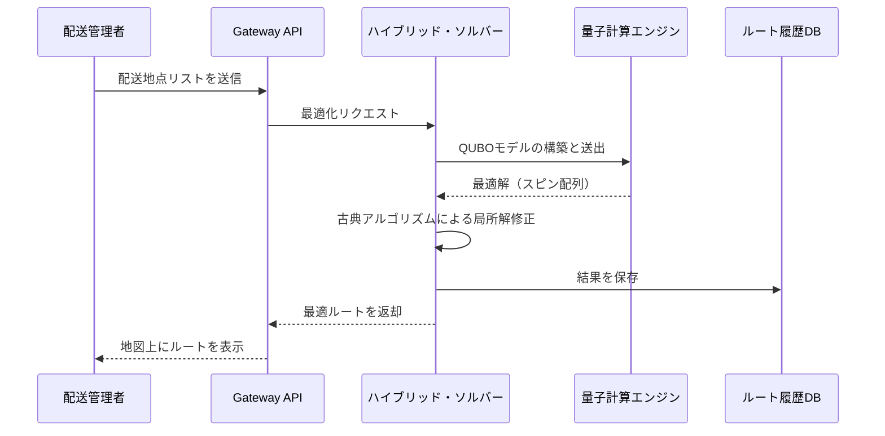

# 次世代物流最適化システム「Q-Logi」設計構想書

## 1. プロジェクト概要

本プロジェクトは、量子アニーリングと古典的なアルゴリズムを組み合わせたハイブリッド手法により、複雑な配送ルートの最適化（VRP: Vehicle Routing Problem）をリアルタイムで解決するシステムの構築を目的とします。

## 2. システムアーキテクチャ

システムの全体像を以下のシーケンス図に示します。



## 3. 数理モデル

本システムでは、コスト関数を最小化することで配送効率を最大化します。目的関数 $H$ は以下のように定義されます。

### 目的関数

配送コスト（距離）の最小化と、制約条件の遵守を同時に考慮します。

$$H=A\sum^{N}_{i=1}(1-\sum^{K}_{j=1}x_{i,j})^2+B\sum^{K}_{j=1}\sum_{j,p,q}d_{p,q}x_{i,j,p}x_{i+1,j,q}$$

ここで：

*   $x_{i,j}$ は地点 $i$ に車両 $j$ が訪れるかどうかを示すバイナリ変数
*   $d_{p,q}$ は地点 $p$ から $q$ への移動コスト
*   $A,B$ は各項の重みを調整するペナルティ係数

インライン数式の例：このモデルでは全地点の訪問を $N$ 個の制約として扱います。

## 4. プロトタイプ実装（Python）

以下は、配送地点間の距離行列を計算し、基本的なソルバーインターフェースを定義するコードの抜粋です。

```python
import numpy as np

class QLogiSolver:
    def __init__(self, locations):
        """
        locations: List of tuples (x, y)
        """
        self.locations = locations
        self.num_points = len(locations)

    def calculate_distance_matrix(self):
        """地点間のユーグリッド距離行列を生成"""
        matrix = np.zeros((self.num_points, self.num_points))
        for i in range(self.num_points):
            for j in range(self.num_points):
                p1 = self.locations[i]
                p2 = self.locations[j]
                matrix[i][j] = np.sqrt((p1[0] - p2[0])**2 + (p1[1] - p2[1])**2)
        return matrix

    def solve(self):
        # ここに量子デバイスまたはシミュレータへの接続ロジックを記述
        print("Optimizing route using Hybrid Solver...")
        return [0, 2, 1, 3, 0] # サンプルの巡回ルート

# 実行例
pts = [(0, 0), (1, 2), (3, 1), (5, 4)]
solver = QLogiSolver(pts)
dist_m = solver.calculate_distance_matrix()
print(f"Distance Matrix:\n{dist_m}")
```

## 5. 今後の課題

*   **動的再計算**: 交通渋滞情報のリアルタイム反映（API連携）。
    
*   **制約の追加**: 車両の積載重量制限（Capacity Constraints）の厳密なモデル化。
    

*Generated for Testing Purposes*